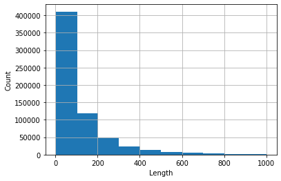
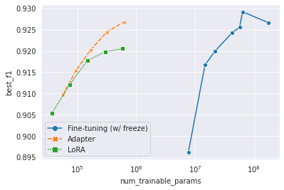

# KR3: Korean Restaurant Review with Ratings

Korean sentiment classification dataset  

- Size: 460K(+180K)
- Language: Korean-centric

🔍 See More  
[Blog Post](https://blog.diyaml.com/)  
[Hugging Face Hub](https://huggingface.co/datasets/Wittgensteinian/KR3)  
[Kaggle Dataset](https://www.kaggle.com/ninetyninenewton/kr3-korean-restaurant-reviews-with-ratings)  
[Gitlab (original repo)](https://gitlab.com/Wittgensteinian/kr3)

## Dataset Description

### Where to download the dataset
Due to file size limit, we couldn't include the dataset in GitHub repo.  
Please check the above links to access the dataset.

### Files

We provide two versions, **kr3** and **kr3_raw**, in two formats, *.parquet* and *.csv*.
|         | Is it preprocessed? |                    Columns                   |
|:-------:|:-------------------:|:--------------------------------------------:|
|   kr3   |         Yes         | 'Rating' and 'Reivew'                        |
| kr3_raw |          No         | 'Rating', 'Review', 'Region', and 'Category' |

### Rating

Column 'Rating' is the label for sentiment classification.

#### 0 and 1

*0* for *negative* reviews, *1* for *positive* reviews. These are the labels for classic supervised learning.

#### 2

⚠️ *2* which reperesents *ambiguous* reviews are **not intended for supervised learning, i.e. classification.**  
Positive reviews and negative reviews are mixed up within this label. Consider this. Rating 3 out of 5 would be a positive review for someone, but the opposite for someone else.
A lot of previous datasets excluded these *ambiguous* data, but we include them for the purpose of pre-training or other usage.

#### Distribution

|       label      | #(samples) |
|:----------------:|:----------:|
|  0 (Negative) |    70910   |
|  1 (Positive) |   388111   |
| 2 (Ambiguous) |   (+182741)   |
|     **Total** |   **459021(+182741)**   |  

<br>

### Length of Reviews

<br>

```
>>> kr3['Review'].str.len().describe()
count    641762.000000
mean        127.470026
std         178.357159
min           3.000000
25%          35.000000
50%          67.000000
75%         149.000000
max        3971.000000
```

Histogram of reviews whose length < 1000 (These take up more than 99% of the dataset).



## Dataset Preview

<br>

```
1,'고기가 정말 맛있었어요! 육즙이 가득 있어서 너무 좋았아요 일하시는 분들 너무 친절하고 좋습니다 가격이 조금 있기는 하지만 그만한 맛이라고 생각!'
0,'11시부터 줄을 서서 주문함. 유명해서 가봤는데, 가격은 비싸고 맛은 그럭저럭. 10분 기다리고 먹을만하고, 그 이상 기다려야 하면 안 먹는 게 나음'
1,'맛있어요 항상 가는 단골이에요. 냄새도 안 나고 구수해요.'
2,'유명세에 비해 순대 맛은 그저 그런 순대 속이 그냥 당면이다'
```

---------------------------

## Dataset Construction Strategy & Preproceesing

Read [README](./data/README.md) in `/data`.

## Experiments

### Zero-shot Sentiment Classification using GPT-2

Simple tutorial. See `tutorial.ipynb`.

### Parameter-efficient Tuning

As the size of pre-trained model grows exponentially, it's ineffcient or nearly impossible to store all the fine-tuned models. Parameter-efficient tuning aims to acheive adaption only with small modules. We used [adapter](https://www.semanticscholar.org/paper/Parameter-Efficient-Transfer-Learning-for-NLP-Houlsby-Giurgiu/29ddc1f43f28af7c846515e32cc167bc66886d0c) and [LoRA](<https://www.semanticscholar.org/paper/LoRA%3A-Low-Rank-Adaptation-of-Large-Language-Models-Hu-Shen/a8ca46b171467ceb2d7652fbfb67fe701ad86092>). See more in `/yejoon`. See [W&B dashboard](https://wandb.ai/wittgensteinian/Parameter-Efficient-Tuning).



## License & Legal Issues

### License

**CC BY-NC-SA 4.0**

### Legal Issues

We concluded that the release and usage of KR3 fall into the range of fair use (공정 이용) stated in the Korean copyright act (저작권법). We further clarify that we did not agree to the terms of service from any websites which might prohibit web crawling. In other words, web crawling we've done was proceeded without logging in to the website. Despite all of these, feel free to contact to any of the contributors if you notice any legal issues.

## Contributors & Acknowledgement

### Contributors

(Alphabetical order)

[Dongin Jung](https://github.com/dongin1009)

[Hyunwoo Kwak](https://github.com/Kwak-Hyun-woo)

[Kaeun Lee](https://github.com/Kaeun-Lee)

[Yejoon Lee](https://github.com/wittgensteinian)

### Acknowledgment

This work was done as DIYA 4기. Compute resources needed for the work was supported by [DIYA](https://blog.diyaml.com) and [surromind.ai](surromind.ai).
